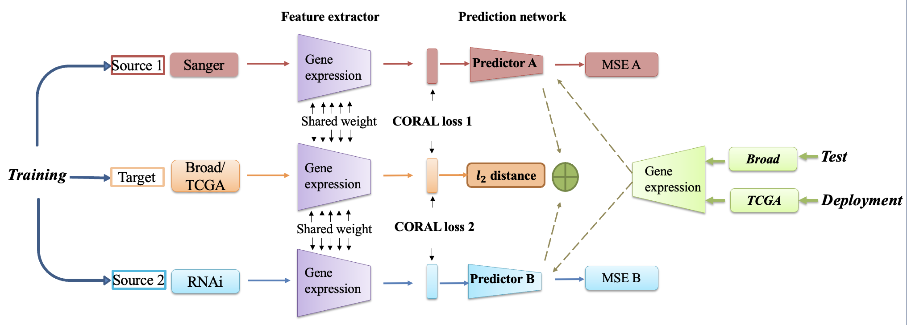

# Predicting a Cancer Dependency Map of Tumors with Unsupervised Domain Adaptation
## Overview

This repository contains the code and data for the paper "Predicting a Cancer Dependency Map of Tumors with Unsupervised Domain Adaptation". The project aims to enhance the translation of findings from cancer cell lines (CCLs) to clinical settings by employing deep unsupervised domain adaptation (UDA) techniques.

## Methodology

Our method, DepPred, combines labeled CCL data and unlabeled breast cancer (BC) patients data from The Cancer Genome Atlas (TCGA) to predit the dependency map of BC patients. The approch includes:
 
 1. **Shared Encoder Network**: Processes gene expression data to reduce dimensionality and align feture distribution using Deep CORrelation Alignment (CORAL) loss.

 2. **Independent Prediction Networks**: Predict gene dependency scores for labeled CCL data using two independent networks.

 3. **Combining Predictions**: Averages predictions from both networks to produce dinal dependency scores for the target domain.



## Code and Usage

To run the model and reproduce the results:
```sh
python TrainMultiModelBroad.py
```

## Contact

For any questions or inquiries, please contact Yu Shi at ysherry.shi@mail.utoronto.ca.

## References

Please refer to the paper for a detailed list of references.
